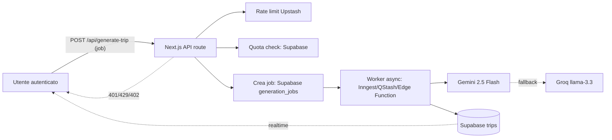

## Situazione attuale (rischi)

Oggi `[app/api/generate-trip/route.ts](app/api/generate-trip/route.ts)`:

- **non richiede login** → chiunque può bruciare le tue quote Gemini/Groq via bot;
- **non ha rate limit** né quote → un singolo utente può generare 100 itinerari/h;
- **è sincrono** e dura 15-40s → non sta nel timeout di 10s di Vercel Hobby;
- **non cachea nulla di riutilizzabile** (foto cover, meteo a parte);
- **usa chiavi AI dirette** da `[.env.local](.env.local)`, senza log di consumo per utente.

Con migliaia di utenti il collo di bottiglia è il **costo AI** (non la CPU): a ~4 centesimi per generazione con Gemini 2.5 Flash, 10k generazioni/mese = ~400 €/mese, e senza quote freemium la stima salta per aria al primo utente abusivo o bot.

## Architettura target

L'utente riceve subito un `jobId` e ascolta via **Supabase Realtime** (già abilitato su `trips`) la comparsa del viaggio generato.

## Fase 1 — Blindare subito l'endpoint (priorità massima, 1 giornata)

Questo va fatto **prima** di pubblicare. Senza queste protezioni migliaia di utenti = bancarotta.

1. **Auth obbligatoria** in `[app/api/generate-trip/route.ts](app/api/generate-trip/route.ts)`: crea un server client Supabase (riusa `[lib/supabase/server.ts](lib/supabase/server.ts)`), leggi `supabase.auth.getUser()`, rispondi `401` se manca. Questo da solo elimina i bot anonimi.
2. **Rate limit per utente** con [Upstash Redis + @upstash/ratelimit](https://upstash.com/docs/redis/sdks/ratelimit-ts/gettingstarted) (gratis fino a 10k cmd/giorno): max 3 richieste/minuto e 20/giorno per `user_id`. Funziona anche da Vercel/Cloud Run.
3. **Quota mensile freemium** in Supabase: nuova tabella `ai_usage(user_id, month, generations_count, plan)` + funzione `can_generate(user_id) returns boolean` richiamata all'inizio della route. Ritorna `402 Payment Required` con `{ code: "quota_exceeded", plan, limit, used }`.
4. **Verifica input lato server** oltre a quello lato client: date entro ±2 anni, durata viaggio ≤ 30 giorni (oggi potresti generare viaggi di 365 giorni).
5. **Cloudflare Turnstile / hCaptcha su signup** (non sul generate): blocca la creazione di account bot a monte, è più efficace del captcha per ogni richiesta.

## Fase 2 — Rendere la generazione asincrona (priorità alta, 2-3 giornate)

La generazione sincrona da 15-40s non scala e non sta nei limiti serverless. Sposta il lavoro in background:

1. **Nuova tabella `generation_jobs(id, user_id, status, input, trip_id, error, created_at)`** con RLS per owner.
2. **`POST /api/generate-trip`** diventa _enqueue_: crea il job, risponde in <500ms con `{ jobId }`.
3. **Worker** che legge dal job, chiama `generateTrip()` (logica già pronta in `[lib/ai.ts](lib/ai.ts)`), scrive il Trip in `public.trips` e aggiorna `generation_jobs.status = 'done'`. Opzioni in ordine di semplicità:
   - **[Inngest](https://www.inngest.com/)** (free tier generoso, funziona su Vercel/Next): 1 function, timeout 15min, retry automatici, UI di debug. Consigliato.
   - **Upstash QStash** (webhook schedulato, pagamento a richiesta).
   - **Supabase Edge Function con background tasks** (`EdgeRuntime.waitUntil`): gratis, ma max 400s e debugging più scomodo.
4. **Client** ascolta via Supabase Realtime (già attivo in `[supabase/schema.sql](supabase/schema.sql)`) l'inserimento del nuovo trip → niente polling. `[components/NewTripDialog.tsx](components/NewTripDialog.tsx)` va adattato per mostrare uno stato "sto generando…" con progresso stimato.
5. **Idempotenza**: il `POST` accetta un `Idempotency-Key` (hash di input+userId+minuto) per evitare doppie generazioni se l'utente ritenta.

## Fase 3 — Ridurre i costi AI (priorità media)

1. **Cache deterministica per destinazioni "template"**: chiave `destination_normalized + duration_days + season` (non include le note utente). Se esiste un template recente (<30gg) **e** l'utente è free tier **e** le note sono vuote, servi il template e fai solo una personalizzazione leggera. Risparmio stimato: 40-60% delle chiamate.
2. **Routing per piano**:
   - Free → **Groq llama-3.3** come primario (gratis/quasi-gratis, veloce, qualità buona).
   - Paid → **Gemini 2.5 Flash** come primario (qualità/consistenza migliore), Groq fallback.
   - La logica è già a 80% in `generateTrip()` in `[lib/ai.ts](lib/ai.ts)`: basta invertire l'ordine di `providers` in base a `plan`.
3. **Accorcia il prompt** — oggi in `buildBasePrompt` spedisci sempre tutte le date espanse: ok, ma rimuovi lo schema verboso nel prompt Groq (`JSON.stringify(tripResponseSchema)` da 1.2kB) quando il modello supporta già `response_format: json_object` — risparmi ~400 token per richiesta.
4. **Cover image e meteo** sono già cacheabili: confermare `cache-control` su `[app/api/image/route.ts](app/api/image/route.ts)` (già presente) e aggiungerlo anche a `[app/api/weather/route.ts](app/api/weather/route.ts)` (oggi manca).

## Fase 4 — Hosting consigliato

Dato il workload (richiesta < 1s + job AI 15-40s), **non** tenerli sullo stesso runtime serverless:

- **Frontend + API "leggere"** → **Vercel Hobby o Pro**. Bene per Next.js 16.
- **Job AI** → scegli in base a budget/complessità:
  - **Consigliato**: **Inngest** (free tier fino a 50k step/mese) invocato dalla route Vercel. Zero infra, ottima observability, timeout 15min.
  - Alternativa zero-dipendenze esterne: **Fly.io / Railway** con un piccolo container Node che fa polling su `generation_jobs` (1 worker = 5-10€/mese, scala orizzontalmente).
  - Da evitare: tenere il job dentro la route Vercel Hobby (timeout 10s) o Pro (60s, ma paghi ogni secondo di attesa AI → costoso).

## Fase 5 — Osservabilità e anti-abuso

1. Log strutturato per ogni generazione: `user_id, provider, model, latency_ms, tokens_in, tokens_out, cost_estimate, fell_back`. Basta una tabella `ai_events` su Supabase o [Axiom](https://axiom.co/) free tier.
2. **Alert di spesa**: cron giornaliero che somma `cost_estimate` e manda email se > soglia (es. 20€/giorno).
3. **Dashboard admin semplice** (una pagina Next protetta da `role=admin`) con: generazioni/giorno, top utenti, tasso di fallback, errori recenti.
4. **Key rotation**: sposta le chiavi AI da `.env.local` a variabili su Vercel/hosting, e valuta [Google Vertex AI](https://cloud.google.com/vertex-ai) al posto di Gemini diretta quando passi in produzione (fatturazione unificata, quote più alte, audit log nativo).

## Riepilogo priorità

- **Da fare prima di mettere online**: Fase 1 completa (auth + rate limit + quota). Senza questo sei esposto.
- **Entro il primo mese di utenti reali**: Fase 2 (async) + Fase 5 (monitor). Senza async la UX crolla con più di 2-3 richieste simultanee sullo stesso utente.
- **Quando vedi i primi numeri reali**: Fase 3 (ottimizzazione costi) e Fase 4 (split hosting).
