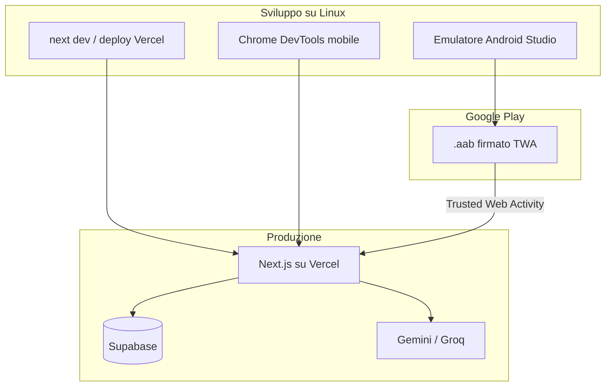
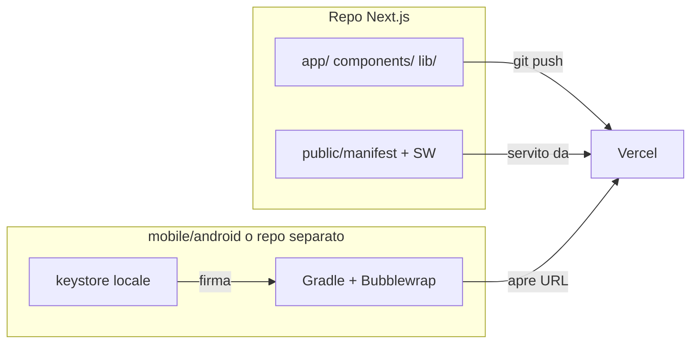

# Piano Android: da web app a Google Play

## Raccomandazione: PWA + TWA (non riscrivere l'app)

Per **AI-tinerary** il percorso migliore è **non copiare** il codice in un altro framework (React Native, Flutter, ecc.), ma **riusare la stessa web app** già deployata su [https://ai-tinerary-nine.vercel.app/](https://ai-tinerary-nine.vercel.app/).

| Approccio                   | Pro                                                                                             | Contro                                               |
| --------------------------- | ----------------------------------------------------------------------------------------------- | ---------------------------------------------------- |
| **PWA + TWA** (consigliato) | Minimo lavoro, un solo codebase, aggiornamenti istantanei lato server, runtime Chrome ufficiale | Meno plugin nativi (push, biometria)                 |
| Capacitor                   | Plugin nativi, stesso codice web                                                                | Più setup, WebView meno performante di TWA per mappe |
| React Native / Flutter      | UX 100% nativa                                                                                  | Riscrittura totale: mappe, DnD, i18n, Supabase, AI   |

**Perché TWA funziona qui:** l'app ha già UI mobile ([`components/MobileNav.tsx`](components/MobileNav.tsx), safe-area in [`styles/globals.css`](styles/globals.css)), backend server-side (`app/api/*` con chiavi segrete), e dipendenze web standard (MapLibre, Supabase, Web Speech). Un wrapper TWA è essenzialmente Chrome a schermo intero che carica il tuo URL Vercel.



---

## Struttura repo: cosa resta in Next.js e cosa separare

**Sì, puoi mantenere l'app Next.js quasi incontaminata.** Con TWA non si "copia" l'app: il wrapper Android è un guscio vuoto che apre il tuo URL Vercel. La separazione riguarda _dove mettere i file_, non _riscrivere il codice_.

### Cosa va nel repo Next.js (minimo, utile anche al web)

Queste modifiche non sono "sporco Android": sono feature web legittime che migliorano anche chi usa il sito da browser.

| File / modifica                      | Perché resta qui                                                 |
| ------------------------------------ | ---------------------------------------------------------------- |
| `public/manifest.webmanifest`        | Standard PWA, serve anche a "Installa app" su desktop/mobile web |
| `public/icons/*`                     | Icone web + manifest                                             |
| `public/.well-known/assetlinks.json` | File statico servito da Vercel, non codice Android               |
| `next.config.ts` + service worker    | Config PWA (Serwist), ~10-20 righe                               |
| `app/layout.tsx`                     | 3-4 tag `<link>` / `<meta>` nel `<head>`                         |
| Account deletion, Privacy Policy     | Requisiti Play, ma sono feature dell'app stessa                  |

**Impatto sul codice esistente:** nessun fork, nessun `if (isAndroid)`, nessuna dipendenza Gradle/Java nel `package.json` di Next.js.

### Cosa va FUORI dal repo Next.js (wrapper Android)

Il progetto TWA generato da Bubblewrap è **Gradle + Java/Kotlin + APK**: non ha senso mescolarlo con `app/`, `components/`, ecc.

**Struttura consigliata (monorepo leggero):**

```
ai-tinerary/                    ← repo attuale, invariato nella struttura
├── app/
├── components/
├── public/
│   ├── manifest.webmanifest    ← nuovo
│   ├── icons/                  ← nuovo
│   └── .well-known/
│       └── assetlinks.json     ← nuovo
├── next.config.ts              ← + Serwist
└── mobile/                     ← NUOVA cartella, isolata
    └── android/                ← progetto Bubblewrap / Android Studio
        ├── app/
        ├── gradle/
        ├── twa-manifest.json
        └── build.gradle
```

**Alternativa equivalente:** repo Git separato `ai-tinerary-android` che contiene solo il wrapper TWA. Utile se non vuoi nemmeno `mobile/` nel repo principale.

### Cosa NON committare mai

- `*.jks` / `*.keystore` (chiavi di firma Play) → solo in password manager o secret store locale
- `mobile/android/local.properties` (path SDK locale)
- `mobile/android/app/build/` (artefatti di build)

Aggiungere a [`.gitignore`](.gitignore):

```
mobile/android/local.properties
mobile/android/**/build/
*.jks
*.keystore
```

### Confronto: "incontaminata" vs "separata"

| Scenario                                           | Next.js incontaminato?                       | Consigliato?                                       |
| -------------------------------------------------- | -------------------------------------------- | -------------------------------------------------- |
| TWA in `mobile/android/` + PWA minima in `public/` | **Sì** — il 95% del codice resta identico    | **Sì**                                             |
| TWA nella root del repo (Gradle accanto a `app/`)  | No — Gradle e Next.js si pestano i piedi     | No                                                 |
| Capacitor con `capacitor.config.ts` nella root     | Parziale — aggiunge dipendenze e sync webDir | Solo se servono plugin nativi                      |
| Repo separato solo per TWA                         | **Sì, al 100%**                              | Sì se preferisci zero cartelle mobile nel repo web |

### Flusso di lavoro quotidiano

1. Sviluppi come oggi: `npx next dev` nel repo principale
2. Push su Vercel → l'app mobile si aggiorna **automaticamente** (TWA carica sempre l'URL remoto)
3. Ricompili il `.aab` solo quando cambi: package name, icone launcher Android, splash nativo, permessi — non ad ogni feature web



**In sintesi:** separa solo il guscio Android (`mobile/android/` o repo dedicato). Nel repo Next.js accetta solo le poche aggiunte PWA e i requisiti store (privacy, account deletion) — sono miglioramenti dell'app web, non contaminazione da mobile.

---

## Fase 1 — Rendere l'app una PWA solida (nel repo attuale)

Oggi mancano manifest, icone e service worker ([`app/layout.tsx`](app/layout.tsx) ha solo viewport; [`public/`](public) ha 3 SVG di default).

### 1.1 Manifest e icone

- Creare [`public/manifest.webmanifest`](public/manifest.webmanifest):
  - `name`: "AI-tinerary", `short_name`: "AI-tinerary"
  - `start_url`: `/`, `display`: `standalone`
  - `theme_color` / `background_color`: `#121212` (coerente con il layout)
  - icone: 192×192, 512×512, maskable
- Generare set icone in `public/icons/` (da un logo 1024×1024)
- Aggiornare [`app/layout.tsx`](app/layout.tsx): `<link rel="manifest">`, `theme-color`, `apple-touch-icon`

### 1.2 Service worker

- Integrare **Serwist** o `@ducanh2912/next-pwa` in [`next.config.ts`](next.config.ts)
- Strategia cache:
  - **Network-first** per `/api/*` (generazione AI, geocode, meteo — non cachare risposte stale)
  - **Cache-first** per asset statici (JS/CSS/font)
- Obiettivo: passare Lighthouse PWA audit (installabile + offline shell minimo)

### 1.3 Verifiche funzionali mobile

Funzionalità già presenti, da testare su Chrome Android:

- **MapLibre** ([`components/TripMap.tsx`](components/TripMap.tsx)) — funziona bene in TWA
- **Web Speech** ([`hooks/useSpeechRecognition.ts`](hooks/useSpeechRecognition.ts)) — supportato su Chrome Android; prevedere fallback UI se `unsupported`
- **OAuth Google** ([`app/login/page.tsx`](app/login/page.tsx)) — richiede redirect URL configurati in Supabase (vedi Fase 2)

---

## Fase 2 — Auth e configurazione produzione

Deploy già attivo su Vercel. Azioni rimanenti:

### 2.1 Supabase Auth URLs

In Supabase Dashboard → Auth → URL Configuration:

- **Site URL**: `https://ai-tinerary-nine.vercel.app`
- **Redirect URLs**: aggiungere `https://ai-tinerary-nine.vercel.app/auth/callback` (e eventuale dominio custom futuro)

### 2.2 Account deletion (obbligatorio Play Store con login)

Non esiste ancora. Aggiungere:

- UI in [`components/UserMenu.tsx`](components/UserMenu.tsx) o pagina impostazioni
- API route `app/api/account/delete/route.ts` che cancella righe `trips` + utente Supabase
- Usare service role key solo server-side

### 2.3 Privacy Policy

URL pubblico obbligatorio per Play Console (l'app invia dati a Supabase, Gemini, Groq, Open-Meteo, Nominatim).

---

## Fase 3 — Wrapper Android TWA

### 3.1 Generare il progetto Android

Su Linux, con Node.js installato:

```bash
# Opzione A: Bubblewrap CLI
npx @bubblewrap/cli init --manifest https://ai-tinerary-nine.vercel.app/manifest.webmanifest

# Opzione B: PWABuilder (UI web) → scarica progetto Android Studio
```

Output: cartella `mobile/android/` (o repo Git separato). **Non** generare Bubblewrap nella root del progetto Next.js.

### 3.2 Digital Asset Links

Per nascondere la barra del browser in TWA, servono due file:

- `https://ai-tinerary-nine.vercel.app/.well-known/assetlinks.json`
- Chiave SHA-256 del keystore di upload Play

Flusso:

1. Creare keystore di firma (`keytool` — disponibile su Linux con JDK)
2. Firmare `.aab` con quel keystore
3. Pubblicare `assetlinks.json` come route statica in [`public/.well-known/assetlinks.json`](public/.well-known/assetlinks.json) o rewrite Vercel
4. Verificare con [Google Statement List Tester](https://developers.google.com/digital-asset-links/tools/generator)

### 3.3 Build e upload

- Aprire progetto in **Android Studio** (funziona su Linux)
- Build → Generate Signed Bundle (`.aab`)
- Caricare su Google Play Console (account 25$ una tantum + verifica identità)

---

## Come testare su Linux durante lo sviluppo

### Livello 1 — Rapido (ogni giorno, zero setup extra)

| Tool                                    | Cosa testa                           |
| --------------------------------------- | ------------------------------------ |
| `npx next dev` + Chrome                 | UI responsive, touch, navigazione    |
| Chrome DevTools → Toggle device toolbar | Layout mobile, safe-area, bottom nav |
| Lighthouse (Chrome DevTools → PWA)      | Installabilità, manifest, SW         |
| `chrome://inspect`                      | Debug remoto se colleghi telefono    |

Comando utile: aprire `http://localhost:3000` con viewport iPhone/Pixel preset.

### Livello 2 — PWA installabile (dopo Fase 1)

1. Deploy su Vercel (o `next build && next start` con tunnel HTTPS)
2. Chrome desktop → icona "Installa app" nella barra URL
3. Verifica: si apre in finestra standalone, niente barra browser

**Nota:** TWA e installazione PWA richiedono **HTTPS**. In locale usa un tunnel:

```bash
npx cloudflared tunnel --url http://localhost:3000
# oppure ngrok http 3000
```

### Livello 3 — Emulatore Android (test TWA realistico)

**Prerequisiti Linux:**

```bash
# Android Studio (include SDK + emulator)
# JDK 17+
sudo apt install openjdk-17-jdk   # Debian/Ubuntu
```

**Setup:**

1. Installare [Android Studio](https://developer.android.com/studio) su Linux
2. AVD Manager → creare emulatore Pixel 7 / API 34 con Google Play
3. Avviare emulatore, aprire Chrome → navigare a `https://ai-tinerary-nine.vercel.app`
4. Testare login, mappe, generazione viaggio, voce

**Test TWA/APK:**

```bash
# Dopo bubblewrap init
cd android-twa
./gradlew assembleDebug          # APK debug
adb install app/build/outputs/apk/debug/app-debug.apk
adb logcat | grep -i chromium    # debug WebView/Chrome
```

### Livello 4 — Dispositivo fisico Android (consigliato prima del Play upload)

1. Abilitare **Opzioni sviluppatore** + **Debug USB** sul telefono
2. `adb devices` per verificare connessione
3. Installare APK debug TWA o usare Chrome sul telefono puntando a Vercel
4. Test critici: OAuth Google, MapLibre pan/zoom, drag-and-drop attività, input vocale

### Matrice test consigliata

| Funzione             | Chrome DevTools | Emulatore | Telefono fisico |
| -------------------- | --------------- | --------- | --------------- |
| Layout / nav mobile  | Sì              | Sì        | Sì              |
| PWA install          | Parziale        | Sì        | Sì              |
| TWA fullscreen       | No              | Sì        | Sì              |
| OAuth Google         | No (redirect)   | Sì        | **Sì**          |
| Web Speech           | No (desktop)    | Sì        | **Sì**          |
| MapLibre performance | Parziale        | Sì        | **Sì**          |

---

## Requisiti Google Play (non solo tecnici)

- **Account Play Console**: 25$ una tantum
- **Data Safety form**: dichiarare email, dati viaggio, terze parti (Supabase, AI, mappe)
- **Privacy Policy URL** pubblico
- **Cancellazione account in-app** (con login Supabase)
- **Asset listing**: icona 512×512, screenshot telefono (min 2), feature graphic 1024×500, descrizioni IT/EN
- **Content rating**: questionario IARC

---

## Quando scegliere Capacitor invece di TWA

Passa a Capacitor solo se in futuro servono:

- Push notifications native
- Deep link `aitinerary://` per OAuth senza browser esterno
- Plugin nativi (fotocamera, condivisione sistema, geolocalizzazione background)

Per la prima pubblicazione su Play, TWA è il percorso con **meno rischio e meno manutenzione**.

---

## Ordine di lavoro suggerito

1. PWA (manifest + icone + service worker) → deploy Vercel → test Lighthouse
2. Creare `mobile/android/` (o repo separato) + aggiornare `.gitignore`
3. Supabase redirect URLs + test login su emulatore
4. Account deletion + Privacy Policy
5. Bubblewrap TWA in `mobile/android/` → emulatore Linux → telefono fisico
6. `assetlinks.json` + build `.aab` firmato
7. Play Console listing + upload

**Stima effort:** ~3-4 giornate tecniche + 1-2 giornate asset/legali. Review Play tipicamente 1-7 giorni.

---

## Piano iOS (separato)

Per App Store esiste un piano dedicato: [apple_app_store.plan.md](apple_app_store.plan.md).

- **Android:** PWA + TWA (`mobile/android/`)
- **iOS:** Capacitor WebView (`mobile/ios/` o repo `ai-tinerary-ios`)
- **Condiviso nel repo Next.js:** PWA, icone, account deletion, privacy policy

Eseguire prima il lavoro PWA di questo piano: serve come base anche per iOS.
