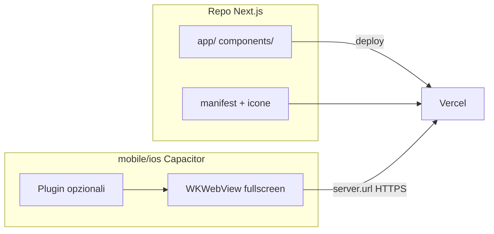

# Piano iOS: da web app a App Store

## Relazione con il piano Android

Questo piano è **complementare** a [android_play_store_4a214723.plan.md](android_play_store_4a214723.plan.md).

| Componente           | Android (TWA)                         | iOS (Capacitor)                                  |
| -------------------- | ------------------------------------- | ------------------------------------------------ |
| App web Next.js      | Condivisa, su Vercel                  | Stessa URL remota                                |
| Wrapper nativo       | `mobile/android/` (Gradle/Bubblewrap) | `mobile/ios/` (Capacitor + Xcode)                |
| PWA manifest + icone | Nel repo Next.js                      | **Riutilizzate** (apple-touch-icon, theme-color) |
| Account deletion     | Nel repo Next.js                      | **Riutilizzata**                                 |
| Privacy Policy       | Nel repo Next.js                      | **Riutilizzata**                                 |
| Build                | Linux + Android Studio                | **Mac obbligatorio** (Xcode)                     |

**Il repo Next.js resta incontaminato:** nessun codice Swift, nessun `ios/` nella root. Solo le aggiunte PWA già previste per Android.

---

## Perché Capacitor e non TWA

Apple **non accetta** le Trusted Web Activity (sono solo Google). Per App Store serve un guscio nativo minimo. **Capacitor** è la scelta standard per wrappare una web app esistente senza riscriverla.



---

## Architettura consigliata

### Repo separato o monorepo leggero

```
ai-tinerary/                 ← invariato (web + PWA)
├── app/
├── public/icons/
└── ...

ai-tinerary-ios/             ← repo separato (consigliato)
├── capacitor.config.ts
├── package.json
├── ios/                     ← generato da Capacitor
└── resources/               ← icone/splash (@capacitor/assets)
```

**Alternativa:** `mobile/ios/` nello stesso monorepo, come `mobile/android/`.

### capacitor.config.ts (variante remote — consigliata)

Per Next.js con API routes server-side, **non** esportare lo statico. Il WebView punta all'URL di produzione:

```typescript
import type { CapacitorConfig } from "@capacitor/cli";

const config: CapacitorConfig = {
  appId: "com.aitinerary.app",
  appName: "AI-tinerary",
  webDir: "dist", // placeholder minimo; non usato in modalità remote
  server: {
    url: "https://ai-tinerary-nine.vercel.app",
    cleartext: false,
  },
  ios: {
    contentInset: "automatic",
    allowsLinkPreview: false,
  },
};

export default config;
```

**Vantaggio:** ogni deploy Vercel aggiorna l'app iOS senza ricompilare, come il TWA Android.

**Quando ricompilare l'IPA:** cambio bundle ID, icone launcher, splash nativo, permessi, plugin nativi.

---

## Fase 1 — Prerequisiti dal piano Android

Prima di iniziare iOS, completare dal piano Android:

1. PWA: `app/manifest.ts`, icone, service worker (Serwist)
2. `apple-touch-icon` e `theme-color` in [`app/layout.tsx`](app/layout.tsx)
3. Account deletion (`/api/account/delete`)
4. Privacy Policy (`/privacy`)
5. Supabase redirect URLs per dominio produzione

Questi elementi servono **anche** a iOS (installazione home screen, requisiti store).

---

## Fase 2 — Setup Capacitor iOS

### 2.1 Creare il progetto wrapper

```bash
mkdir ai-tinerary-ios && cd ai-tinerary-ios
npm init -y
npm install @capacitor/core @capacitor/cli @capacitor/ios
npx cap init "AI-tinerary" com.aitinerary.app --web-dir dist
mkdir dist && echo '<html><body></body></html>' > dist/index.html
npx cap add ios
```

### 2.2 Plugin utili (opzionali ma aiutano la review Apple)

| Plugin                     | Motivo                                      |
| -------------------------- | ------------------------------------------- |
| `@capacitor/splash-screen` | Splash nativo all'avvio                     |
| `@capacitor/status-bar`    | Stile barra stato coerente con tema scuro   |
| `@capacitor/share`         | Condivisione itinerario via share sheet iOS |
| `@capacitor/app`           | Gestione deep link / back button            |

Apple rifiuta app che sono "solo un sito web in un WebView". L'app ha già AI, mappe, meteo, drag-and-drop — superabile. I plugin nativi rafforzano la candidatura.

### 2.3 Icone e splash

```bash
npm install -D @capacitor/assets
# resources/icon.png (1024x1024) e resources/splash.png
npx capacitor-assets generate --ios
```

Riutilizzare le icone generate per il piano Android (`public/icons/`).

---

## Fase 3 — Adeguamenti specifici iOS

### 3.1 Safe area e viewport

Già presenti in [`styles/globals.css`](styles/globals.css) e [`app/layout.tsx`](app/layout.tsx) (`viewport-fit=cover`). Verificare su iPhone con notch:

- bottom nav non coperta dalla home indicator
- `env(safe-area-inset-*)` su [`components/MobileNav.tsx`](components/MobileNav.tsx)

### 3.2 OAuth Google / Supabase

Su WKWebView il flusso OAuth può aprire Safari esterno. Configurare in Supabase:

- Redirect URL: `https://ai-tinerary-nine.vercel.app/auth/callback`
- Opzionale: custom URL scheme `aitinerary://auth/callback` con `@capacitor/app` per chiudere il browser

### 3.3 Web Speech API

[`hooks/useSpeechRecognition.ts`](hooks/useSpeechRecognition.ts) usa API web. Su iOS:

- **Safari/WKWebView recenti:** supporto parziale/variabile
- **Fallback:** lo stato `unsupported` è già gestito; verificare UX su dispositivo reale

### 3.4 MapLibre

MapLibre GL funziona su WKWebView ma può essere più lento del TWA Chrome. Testare pan/zoom su iPhone reale prima della submission.

---

## Fase 4 — Build e pubblicazione (richiede Mac)

| Step            | Tool                    | Note                               |
| --------------- | ----------------------- | ---------------------------------- |
| Aprire progetto | Xcode                   | `npx cap open ios`                 |
| Bundle ID       | Xcode                   | `com.aitinerary.app` (univoco)     |
| Signing         | Xcode + Apple Developer | Certificato + provisioning profile |
| Test interno    | TestFlight              | Invito beta tester                 |
| Submission      | App Store Connect       | Metadata + screenshot              |

**Costo:** Apple Developer Program **99 USD/anno**.

**Linux:** puoi sviluppare il wrapper Capacitor e testare la web app, ma **non puoi firmare né caricare su App Store senza un Mac** (fisico, cloud MacStadium, o CI con runner macOS).

---

## Requisiti App Store (non tecnici)

- **Privacy Policy URL** — stesso del piano Android (`/privacy`)
- **App Privacy "nutrition label"** — dichiarare: email, dati viaggio, identificatori; terze parti: Supabase, Gemini, Groq, mappe, meteo
- **Account deletion in-app** — stesso endpoint del piano Android
- **Screenshot:** iPhone 6.7" (obbligatorio), 6.5", iPad 12.9" se supporti tablet
- **Icona:** 1024×1024 senza trasparenza, senza angoli arrotondati (iOS li applica)
- **Categoria:** Viaggi
- **Classificazione età:** IARC questionnaire
- **Review notes:** spiegare che l'app genera itinerari con AI, non è un semplice wrapper del sito

### Criterio 4.2 (Minimum Functionality)

Apple rifiuta app troppo simili a Safari. Per superare la review:

- evidenziare generazione AI, timeline interattiva, mappe, meteo, condivisione
- considerare 1-2 plugin Capacitor nativi (share, splash)
- non presentare l'app come "versione mobile del sito"

---

## Come testare senza Mac (fino al possibile)

| Cosa                   | Su Linux                                | Limite                        |
| ---------------------- | --------------------------------------- | ----------------------------- |
| UI mobile responsive   | Chrome DevTools                         | OK                            |
| PWA / Safari behavior  | BrowserStack / Sauce Labs (a pagamento) | Simula iOS                    |
| Capacitor config       | Edit + `npx cap sync`                   | OK fino alla build            |
| Build IPA / TestFlight | —                                       | **Richiede Mac**              |
| Test OAuth iOS         | iPhone fisico + Safari                  | OK senza Mac per la parte web |

**Workaround senza Mac proprio:**

- noleggiare Mac cloud (MacStadium, GitHub Actions `macos-latest` per CI)
- chiedere a qualcuno con Mac solo per firma e upload (15-30 min)

---

## Ordine di lavoro suggerito

1. Completare piano Android (PWA, account deletion, privacy)
2. Creare `ai-tinerary-ios` con Capacitor `server.url`
3. Generare icone/splash con `@capacitor/assets`
4. Test web su Safari iOS (BrowserStack o iPhone)
5. Su Mac: Xcode → TestFlight → beta test
6. App Store Connect: metadata, privacy label, screenshot
7. Submission + eventuali round di review (24-72h tipici)

**Stima effort iOS-specifico:** ~2-3 giornate tecniche + Mac per build + 1-2 giornate asset/legali.

---

## Cosa NON fare

- Non riscrivere in Swift/SwiftUI — costo 10× senza beneficio immediato
- Non mettere `ios/` nella root del repo Next.js
- Non bundlare chiavi API nel wrapper Capacitor
- Non aspettarsi di testare l'IPA finale senza Mac o servizio cloud Mac
