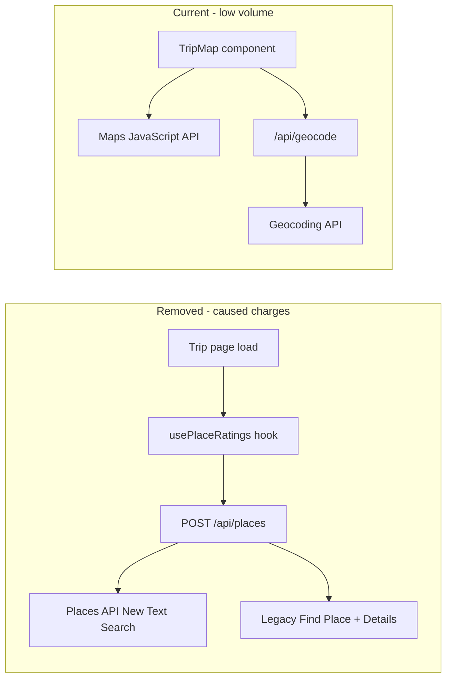

# Google Maps billing inquiry — draft answers

Use the text below in Google’s form. **Verify start/end dates** in [Cloud Console → Billing → Reports](https://console.cloud.google.com/billing) (filter by Places API and day); the screenshot you shared does not include dates. Git only proves when the feature existed in code.

---

## 1. What is the project used for?

**Suggested answer:**

> **AI-tinerary** is a personal, non-commercial Next.js web app that helps users plan trips. Users enter a destination and dates; an AI (Google Gemini / Groq) generates a day-by-day itinerary with activities, descriptions, and locations. The app stores trips locally and, when signed in, in Supabase. Google Maps Platform was used only to (1) show an interactive trip map (**Maps JavaScript API**) and (2) geocode activity locations for map markers (**Geocoding API**). A short-lived feature also tried to show **Google star ratings** on activity cards via the **Places API**; that feature was removed the same day it was added because it caused unintended billing.

---

## 2. How were API keys used to incur excessive usage?

**Suggested answer:**

> One server-side API key (`GOOGLE_MAPS_API_KEY`, same value as `NEXT_PUBLIC_GOOGLE_MAPS_API_KEY`) was used from Next.js API routes on localhost during development. The excessive usage did **not** come from the map or geocoding (Geocoding API: ~24 requests in our metrics). Almost all usage was from **`POST /api/places`**, which fetched Google ratings for every itinerary activity without a saved `placeRating`.
>
> For each activity location, the server called **Places API (New) — Text Search** (`places.googleapis.com/v1/places:searchText`). When that did not return a usable rating, it also called the **legacy Places API** (Find Place + Place Details). That explains why **Places API** and **Places API (New)** both show ~125,000 requests (roughly one New + one legacy path per lookup).
>
> The client hook `usePlaceRatings` ran on trip detail pages (`/trip/[id]` and shared trips). On each page load or trip update, it batched all activities still missing ratings (up to 30 queries per HTTP request) and called `/api/places`. Failed lookups were **not** cached, so the same activities were retried on every reload or trip edit. The server cache was an in-memory `Map` that does not persist on serverless (e.g. Vercel), so repeated requests hit Google again. AI-generated place names were often imprecise, increasing failed lookups and legacy fallback. A trip with many activities × repeated dev reloads × 2 APIs per lookup produced the ~125k request volume and ~€700 charge.

**Evidence from removed code** (commit `8e943c0`, deleted in `8c57aa0`):

```typescript
// app/api/places/route.ts (removed)
const fresh = await searchTextNew(query);
result = fresh.result;
if (!result) result = await searchTextLegacy(query);
```

```typescript
// lib/place-rating.ts (removed) — only successes cached in localStorage
/** Only successful ratings are cached (never `null` — failed lookups retry). */
```

---

## 3. What went wrong, and how did you figure it out?

**Suggested answer:**

> I added Google ratings on activity cards without understanding Places API pricing or how often the app would call it. During development I opened trip pages many times; each visit re-fetched ratings for all activities that still lacked a stored rating. Because misses were not cached and the server cache was not durable, the same locations were billed repeatedly. I also used a dual-path implementation (Places API New + legacy fallback), roughly doubling billable calls per activity.
>
> I identified the cause by opening **Google Cloud Console → APIs & Services → Dashboard** and comparing APIs. Places API and Places API (New) each showed ~125,000 requests, while Geocoding API showed only 24. I then searched the codebase, found `/api/places` and `usePlaceRatings`, and confirmed ratings were the only Places usage (not the map). This matched a code review on 4 June 2026 before removal.

Reference: prior analysis in chat [Places API spike](9cdca6c9-e546-4f56-bcbd-32e17ce0d78d) and screenshot at `assets/image-3ae82433-6513-447f-868b-a2982ae1aa41.png`.

---

## 4. What did you do to address the problem and ensure it doesn't happen again?

**Suggested answer:**

> **Immediate remediation (4 June 2026):**
>
> - Removed all Places/ratings code in git commit `8c57aa0` (“removed places api”): deleted `app/api/places/route.ts`, `lib/place-rating.ts`, `lib/use-place-ratings.ts`, `components/PlaceRatingBadge.tsx`, and all UI wiring.
> - Updated [README.md](README.md) to enable **only** Maps JavaScript API and Geocoding API, with an explicit note not to enable Places API.
> - Stopped using Places API in the application entirely.
>
> **Ongoing preventive measures (you should also do in GCP):**
>
> - Disable **Places API** and **Places API (New)** on the Google Cloud project (APIs & Services → Enabled APIs → disable).
> - Restrict API keys to **Maps JavaScript API** and **Geocoding API** only (Application restrictions: HTTP referrers for production; separate server key if needed).
> - Set **billing budget alerts** and optional **daily quotas** on Maps APIs.
> - Rotate API keys if they were ever exposed in `.env.local` or chat.
> - Delete cached rating data (see section 8).
>
> Current legitimate Maps usage: interactive map ([components/TripMap.tsx](components/TripMap.tsx)) and geocoding ([app/api/geocode/route.ts](app/api/geocode/route.ts)) with client/server caching of coordinates in trip JSON (`geo`) and `localStorage` (`ai-tinerary.trip-map-cache.v1`), not Places content.

---

## 5. Start and end dates of unexpected usage

**Suggested answer (fill after checking Billing Reports):**

> Based on source control, the Places ratings feature was introduced on **4 June 2026** (commit `8e943c0` at 00:08 UTC+2) and removed on **4 June 2026** (commit `8c57aa0` at 07:32 UTC+2). The unexpected Places API spike aligns with that window and repeated local development/testing on that day.
>
> **Please confirm exact billing dates in:** Google Cloud Console → Billing → Reports → filter **Places API** / **Places API (New)** → daily granularity. Replace the dates above if the report shows a different range (e.g. timezone or earlier testing).

If your billing month shows a different spike day, use **that** day from the graph, not only git timestamps.

---

## 6. Terms of Service compliance

**Suggested answer:**

> Yes. The application is a legitimate travel-planning use case: displaying maps and geocoding user/AI-provided destinations for personal itinerary planning, consistent with [Google Maps Platform Terms of Service](https://cloud.google.com/maps-platform/terms). The excessive usage was unintentional development behavior, not scraping, reselling, or misrepresenting Google data. The Places ratings feature has been **fully removed**; we no longer store or display Places-derived ratings. Going forward we only use Maps JavaScript API and Geocoding API as documented in our README.

**Note:** If Google asks about **caching** Places ratings in `localStorage` / Supabase `placeRating` fields, acknowledge that was part of the removed feature and that cached Places content has been deleted (section 8). Do not claim ongoing compliance while that data still exists.

---

## 7. Acknowledgement — responsibility for future charges

**Suggested answer:**

> I acknowledge that I am responsible for any Google Maps Platform charges incurred after any billing adjustment granted under this request, including charges from continued use of Maps JavaScript API and Geocoding API under my API keys and project.

---

## 8. Caching benefits — delete data and screenshot

**Suggested answer:**

> Yes, the removed ratings feature cached successful lookups in:
>
> - Browser `localStorage` keys: `ai-tinerary.place-rating-cache.v1`, `.v2`, `.v3`
> - Trip JSON in Supabase/localStorage: `placeRating` on activities (when logged in, synced via `onTripRatingsSaved`)
>
> **Deletion steps (do before submitting):**
>
> 1. In the browser (app origin): DevTools → Application → Local Storage → remove keys matching `ai-tinerary.place-rating-cache.*`
> 2. In Supabase: run a one-time cleanup on `trips` JSON to strip `placeRating` from activities (or delete test trips created during development)
> 3. In Google Cloud: disable Places APIs (screenshot of “Disabled” or APIs not enabled)
> 4. Attach screenshots: empty localStorage keys + GCP API list without Places enabled
>
> The app still caches **geocode coordinates** (`geo`, `ai-tinerary.trip-map-cache.v1`) for the map; that is separate from Places ratings and is allowed for coordinates under standard Geocoding/Maps usage.

---

## 9. Acknowledgement — apply preventive measures if using services again

**Suggested answer:**

> I acknowledge that if I continue to use Google Maps Platform on this account, I will apply all preventive measures listed above (disable Places APIs, key restrictions, budget alerts, no reintroduction of bulk Places lookups without caching/quota design, and deletion of improperly cached Places content).

---

## Architecture (for your reference)



---

## What you still need to do manually

| Task                                                            | Why                                        |
| --------------------------------------------------------------- | ------------------------------------------ |
| Open GCP Billing Reports → note **exact** spike start/end dates | Form field 5; git is approximate           |
| Disable Places API + Places API (New) in GCP                    | Proves remediation; screenshot for field 8 |
| Clear `placeRating` / localStorage cache                        | Required if you benefited from caching     |
| Screenshots for Google                                          | localStorage cleared + APIs disabled       |
| Optional: strip `placeRating` from Supabase trips               | Orphan JSON may remain after code removal  |

No further code changes are required for the form unless you want a small migration script to strip `placeRating` from stored trips — say if you want that in a follow-up implementation pass.
