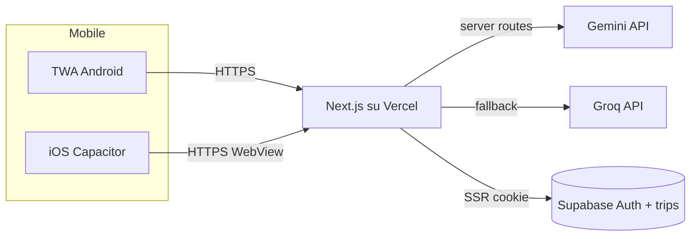

## Punto di partenza

L'app è una web app Next.js con route server (`app/api/generate-trip`, `app/api/image`, `app/api/weather`, `app/auth/callback`) che usano chiavi segrete e cookie Supabase. Non è quindi convertibile in bundle 100% offline: **il backend deve restare online** (es. Vercel) e le app mobili ne diventano client.

Non c'è ancora nessun asset PWA: in [public/](public) ci sono solo 3 SVG di default, in [app/layout.tsx](app/layout.tsx) manca `<link rel="manifest">` e niente service worker.

## Due percorsi realistici

### A. PWA + TWA (percorso minimo, consigliato per iniziare)

Android accetta ufficialmente le PWA impacchettate come Trusted Web Activity (stesso runtime di Chrome, zero WebView custom). iOS **non** accetta "solo un link a una PWA": serve almeno un guscio nativo (Capacitor o equivalente).

Per Android: rendere l'app una PWA installabile, poi generare il bundle con PWABuilder/Bubblewrap.

Per iOS: usare Capacitor con un singolo `WebView` che punta all'URL di produzione (oppure bundlizza lo statico e chiama il backend remoto).

### B. Capacitor per entrambe le piattaforme (più controllo, più lavoro)

Un unico progetto Capacitor che avvolge la web app. Permette plugin nativi (push, geolocalizzazione, share, storage sicuro, biometria) e un'esperienza più "da app", al costo di mantenere un secondo repo/build.

## Lavoro tecnico nel repo attuale

### 1. Preparare l'app come PWA

- aggiungere `public/manifest.webmanifest` (nome, short_name, start_url `/`, display `standalone`, theme_color `#121212`, background `#121212`, icone 192/512/maskable)
- icone: set completo in `public/icons/` (almeno 192, 512, maskable, Apple touch 180)
- in [app/layout.tsx](app/layout.tsx) aggiungere nel `<head>` `<link rel="manifest">`, `<meta name="theme-color">`, `<link rel="apple-touch-icon">` e passare a `export const metadata` di Next per SEO/store
- service worker: il più semplice è `@ducanh2912/next-pwa` o `serwist` con runtime caching per gli asset e network-first per `/api/*`
- assicurarsi che `viewport` includa `viewport-fit=cover` per le safe area iOS

### 2. Adeguare auth e link per il wrapper

- in [app/auth/callback/route.ts](app/auth/callback/route.ts) il redirect usa `request.nextUrl.origin`. In un TWA/Capacitor va configurato come URL assoluto di produzione nel provider OAuth (Supabase Dashboard > Auth > URL Configuration)
- in Supabase aggiungere gli schema URL del wrapper (es. `aitinerary://auth/callback`) se si vuole chiudere il browser esterno dopo OAuth
- verificare che i cookie Supabase (`@supabase/ssr` in [lib/supabase/client.ts](lib/supabase/client.ts) e `lib/supabase/server.ts`) funzionino sotto dominio HTTPS fisso

### 3. Hosting

- deploy del repo su Vercel (o equivalente) con env `GEMINI_API_KEY`, `GROQ_API_KEY`, `NEXT_PUBLIC_SUPABASE_URL`, `NEXT_PUBLIC_SUPABASE_ANON_KEY`
- dominio custom con HTTPS valido: **obbligatorio** per TWA (serve un `.well-known/assetlinks.json` firmato con la chiave di Play)

### 4. Wrapper Android (TWA)

- generare con `npx @bubblewrap/cli init --manifest https://tuo-dominio/manifest.webmanifest` oppure usare [pwabuilder.com](https://www.pwabuilder.com)
- output: progetto Android Studio → build `.aab` (Android App Bundle) firmato
- pubblicare il file `assetlinks.json` su `https://tuo-dominio/.well-known/assetlinks.json` con l'SHA-256 della chiave di upload di Play, altrimenti l'app mostra la barra del browser

### 5. Wrapper iOS (Capacitor)

- progetto separato (cartella `mobile/` o repo dedicato) con `@capacitor/core`, `@capacitor/ios`, `@capacitor/cli`
- `capacitor.config.ts` con `server.url = "https://tuo-dominio"` per la variante "remote webview" (rapida) oppure `webDir` con `next build && next export` parziale se si riesce a separare client e API
- aprire in Xcode, configurare bundle id, capability, splash (`@capacitor/splash-screen`) e icone via `@capacitor/assets`
- App Store è severo sui "reskin di siti": serve almeno qualche plugin nativo (push, share, safe area) e contenuto/funzionalità proprie — l'app ha già generazione AI, mappe, meteo, quindi è superabile

## Requisiti non tecnici per gli store

### Account e costi

- Apple Developer Program: 99 USD/anno, richiede Mac per firmare e caricare via Xcode/Transporter
- Google Play Console: 25 USD una tantum, ora richiede anche una verifica identità/indirizzo

### Asset e metadati di listing (entrambi gli store)

- icona 1024×1024 (App Store) e 512×512 (Play)
- screenshot per più formati: iPhone 6.7" e 6.5", iPad 12.9", telefono Android, tablet 7"/10"
- feature graphic 1024×500 (Play)
- descrizione breve + lunga (Play chiede IT se pubblichi in Italia), keyword (App Store), categoria, classificazione contenuti
- video preview opzionale

### Obblighi legali

- **Privacy Policy pubblica** (URL) — obbligatoria ovunque, ancora di più perché l'app raccoglie email via Supabase e invia input utente a Gemini/Groq
- Terms of Service
- Data Safety form (Play) e App Privacy "nutrition label" (Apple): dichiarare raccolta email, identificatori, dati d'uso, che terze parti ricevono i dati (Supabase, Google Gemini, Groq, provider mappe/meteo)
- GDPR: informativa in italiano, eventuale banner cookie nella versione web
- se si mostra pubblicità o tracciamento su iOS: App Tracking Transparency
- account deletion **in-app**: requisito Apple e Play se c'è login. Aggiungere un endpoint/flow che cancelli l'utente Supabase e le sue righe in `trips`

### Sicurezza chiavi

- nessuna chiave Gemini/Groq deve finire nel bundle mobile: restano server-side nelle API routes su Vercel (già così nel codice attuale, confermato)
- considerare rate-limit per IP/utente sulle route API per evitare abusi dal wrapper pubblico

## Diagramma di flusso consigliato (opzione A)

## Stima di effort

- PWA + manifest + service worker + icone: ~1 giornata
- Hosting + OAuth redirect fix: ~0.5 giornate
- TWA Android pronto per Play (bundle firmato + assetlinks): ~0.5-1 giornata
- Capacitor iOS pronto per TestFlight: ~1-2 giornate (Mac richiesto)
- Asset store, privacy policy, form di privacy, account deletion: ~1-2 giornate
- Review Apple: prima submission tipicamente 24-72h, spesso con 1-2 round di richieste
